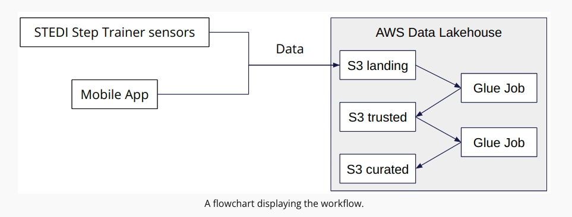

# STEDI Human Balance Analysis

## Project Details

The STEDI Team has been hard at work developing a hardware STEDI Step Trainer that:

trains the user to do a STEDI balance exercise;
and has sensors on the device that collect data to train a machine-learning algorithm to detect steps;
has a companion mobile app that collects customer data and interacts with the device sensors.
STEDI has heard from millions of early adopters who are willing to purchase the STEDI Step Trainers and use them.

Several customers have already received their Step Trainers, installed the mobile application, and begun using them together to test their balance. The Step Trainer is just a motion sensor that records the distance of the object detected. The app uses a mobile phone accelerometer to detect motion in the X, Y, and Z directions.

The STEDI team wants to use the motion sensor data to train a machine learning model to detect steps accurately in real-time. Privacy will be a primary consideration in deciding what data can be used.

Some of the early adopters have agreed to share their data for research purposes. Only these customers’ Step Trainer and accelerometer data should be used in the training data for the machine learning model.

As a data engineer on the STEDI Step Trainer team, you'll need to extract the data produced by the STEDI Step Trainer sensors and the mobile app, and curate them into a data lakehouse solution on AWS so that Data Scientists can train the learning model.

## Project Environment
- Python and Spark
- AWS Glue
- AWS Athena
- AWS S3

## System Architecture

Step 1: Creating an S3 Bucket
aws s3 mb s3://stedi-project-lake-house

Step 2: S3 Gateway Endpoint
aws ec2 create-vpc-endpoint --vpc-id _______ --service-name com.amazonaws.us-east-1.s3 --route-table-ids _______

Step 3: IAM Role
- Creating the Glue Service Role
- Grant Glue Privileges on the S3 Bucket
- Glue Policy

Step 4:
To simulate the data coming from the various sources, we need to create our own S3 directories for customer_landing, step_trainer_landing, and accelerometer_landing zones, and copy the data there as a starting point.

Step 5: 
- Create a 'stedi' database and 2 tables 'customer_landing' and 'accelerometer in Data Catalog
- Go to Athena to explore the data in these tables

Step 6:
The Data Science team has done some preliminary data analysis and determined that the Accelerometer Records each match one of the Customer Records. They would like the Data Engineering team to create 2 AWS Glue Jobs that do the following:
- Sanitize the Customer data from the Website (Landing Zone) and only store the Customer Records who agreed to share their data for research purposes (Trusted Zone) - creating a Glue Table called customer_trusted.
- Sanitize the Accelerometer data from the Mobile App (Landing Zone) - and only store Accelerometer Readings from customers who agreed to share their data for research purposes (Trusted Zone) - creating a Glue Table called accelerometer_trusted.
Note: Change the Compression Type as 'None' for the Customer Trusted and Accelerometer target nodes.