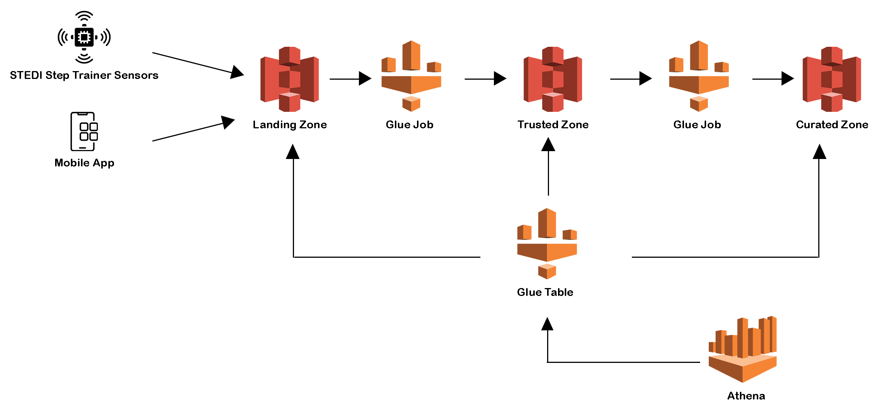

# STEDI Human Balance Analysis

## Overview

The STEDI project is focused on developing a hardware STEDI Step Trainer designed to help users improve their balance through specialized exercises. The device is equipped with sensors that capture data, which is then used to train a machine learning model for step detection. Accompanying the hardware is a mobile app that interacts with the sensors and collects user data, including motion detected by the phone's accelerometer.

STEDI has already garnered significant interest, with millions of early adopters eager to purchase and use the Step Trainer. Some customers have already started using the device, contributing valuable data for research. The project aims to use this data to train a machine learning model that can accurately detect steps in real-time, while maintaining a strong commitment to user privacy.

As part of the STEDI project, the data generated by the Step Trainer and mobile app will be extracted and curated into a data lakehouse solution on AWS. This will enable Data Scientists to train the machine learning model effectively, leveraging the data shared by customers who have consented to its use for research purposes.

## Project Environment
- Python and Spark
- AWS Glue
- AWS Athena
- AWS S3

## System Architecture

## Dataset

1. Customer Records: the data from fulfillment and the STEDI website.

2. Step Trainer Records: the data from the motion sensor.

3. Accelerometer Records: the data from the mobile app.

## Project Steps

<b><u>Step 1:</u></b> 

Creating an S3 Bucket
####
        aws s3 mb s3://[your-bucket-name]

<b><u>Step 2:</u></b> 

S3 Gateway Endpoint
####
        aws ec2 create-vpc-endpoint --vpc-id [your-vpd-id] --service-name com.amazonaws.us-east-1.s3 --route-table-ids [your-route-table-ids]

<b><u>Step 3:</u></b> 

IAM Role
- Creating the Glue Service Role
- Grant Glue Privileges on the S3 Bucket
- Glue Policy

The descriptions is in `glue_service_role.md` file

<b><u>Step 4:</u></b>

To simulate the data from different sources, we'll need to set up our own S3 directories for the customer_landing, step_trainer_landing, and accelerometer_landing zones, and then copy the data into these directories as a starting point.

<b><u>Step 5:</u></b>

- Create your database and 3 tables 'customer_landing', 'accelerometer_landing' and 'step_trainer_landing' in Data Catalog
- Go to Athena to explore the data in these tables

<b><u>Step 6:</u></b>

The Data Science team conducted an initial analysis and found that each Accelerometer Record corresponds to a Customer Record. They have requested that the Data Engineering team set up two AWS Glue Jobs with the following tasks:

- Sanitize the Customer data from the Website (Landing Zone) and store only the records of customers who consented to share their data for research purposes in the Trusted Zone, creating a Glue Table named customer_trusted. `customer_landing_to_trusted.py`
- Sanitize the Accelerometer data from the Mobile App (Landing Zone) and store only the readings from customers who agreed to share their data for research purposes in the Trusted Zone, creating a Glue Table named accelerometer_trusted. `accelerometer_landing_to_trusted.py`

Note: Change the Compression Type as 'None' for the Customer Trusted and Accelerometer target nodes.

<b><u>Step 7:</u></b> 

The Data Scientists have identified a data quality issue with the Customer Data. The serial number, which is supposed to uniquely identify the STEDI Step Trainer each customer purchased, was repeatedly reused due to a defect in the fulfillment website, with the same 30 serial numbers assigned to millions of customers. Although most customers haven't received their Step Trainers yet, those who have are submitting data through the IoT network (Landing Zone), and this data contains the correct serial numbers.

The issue is that because of the serial number bug in the fulfillment data (Landing Zone), we cannot accurately match the Step Trainer Records data to the corresponding customers.

The Data Science team has requested that you create a Glue job with the following tasks:

- Cleanse the Customer data in the Trusted Zone and generate a Glue Table in the Curated Zone, named customers_curated, which includes only customers who have accelerometer data and have consented to share their data for research. `customer_trusted_to_curated.py`
- Process the Step Trainer IoT data stream from S3 and populate a Glue Table in the Trusted Zone, named step_trainer_trusted, containing the Step Trainer Records for customers who have accelerometer data and have agreed to share their data (customers_curated). `step_trainer_landing_to_trusted.py`
- Generate an aggregated table that combines each Step Trainer Reading with the corresponding accelerometer data for the same timestamp, but only for customers who have agreed to share their data, and create a Glue Table named machine_learning_curated. `machine_learning_trusted_to_curated.py`

## Query

- Customer Curated table

- Machine Learning Curated table

